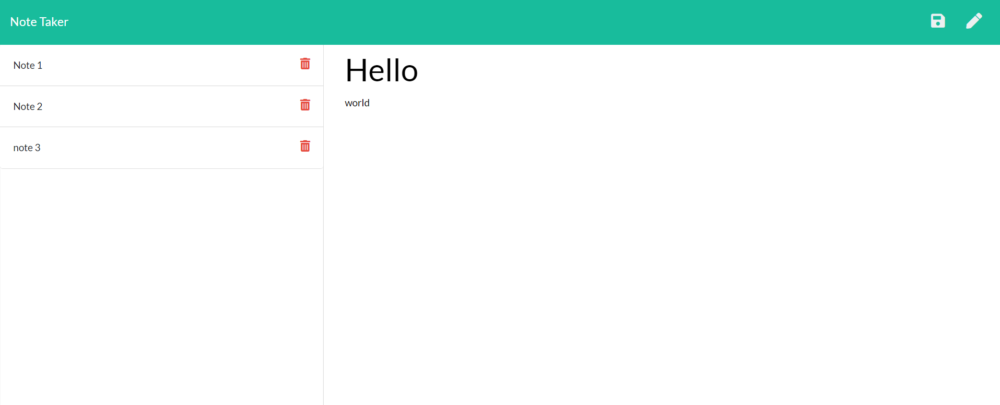

 
    # Note Taker 
   
    This program allows the user to add notes that can be openned at a later time or be delated when they don't need them anymore.
    
* [Installation](#Installation)
    
* [Instructions](#Usage)
    
* [License](#License)
       
    ## Installation
    Git clone then with node npm i to install the packages and then deploy the code to heroku.
    ## Instructions
    A deployed version of the app can be found at: https://peaceful-spire-97610.herokuapp.com/ 

    ## License 
    This project is licensed under the MIT license
    - Email: timiholzer@gmail.com - GitHub Repo: https://github.com/timholzer/HW10

